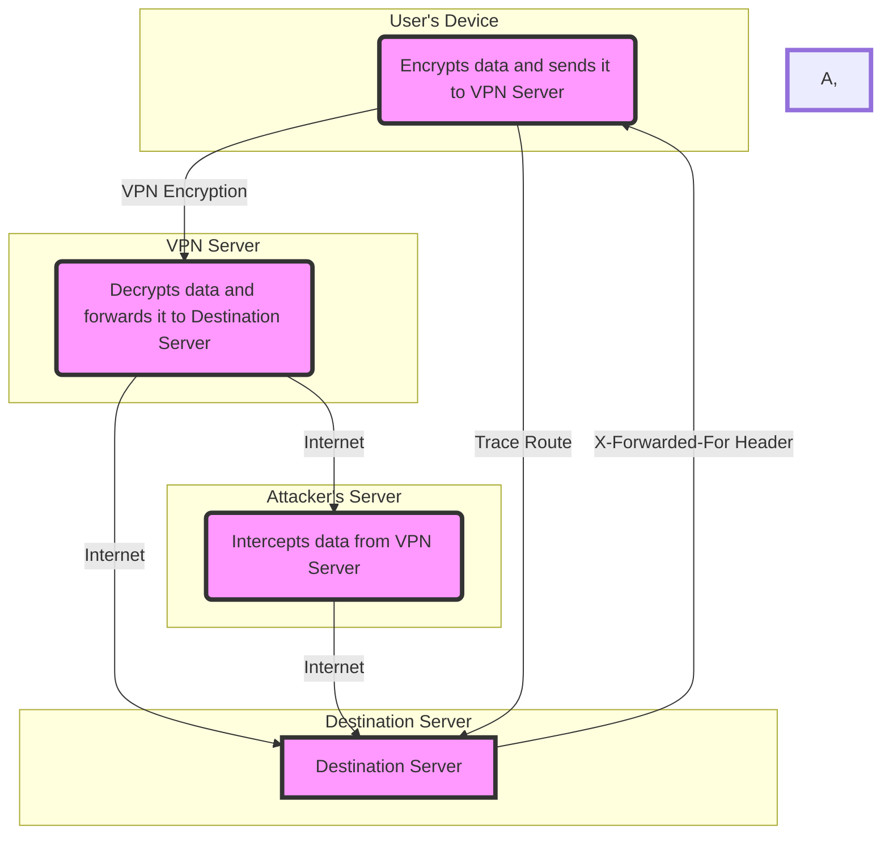

# Understanding VPNs and Header Information Leakage

You've taken a crucial step towards protecting your online privacy by using a VPN. But did you know that even with a VPN, your real IP address could be quietly leaking out?  The problem lies in something called header information leakage, and it could sabotage your efforts to stay anonymous online. Let's unravel this hidden privacy risk and how you can protect yourself.

## Understanding VPNs: Your Digital Cloak (But Not a Suit of Armor)

VPNs act like a secure tunnel for your internet traffic, encrypting your data and hiding your real IP address. Think of it as putting on a digital disguise to shield your browsing history and sensitive information from hackers, snoopers, and trackers.

## Header Information: The Telltale Signs Beneath the Mask

While VPNs encrypt the content of your internet traffic, they may fail to completely hide certain details contained in HTTP headers. These headers, like little digital footprints, can sometimes include a leaky clue – your original IP address. The X-Forwarded-For header is a common culprit in exposing your true identity, even while using a VPN.

## The Web of Proxies: Another Layer of Complexity

Sometimes, your VPN traffic might travel through proxy servers. These intermediaries can handle traffic between you and the websites you visit. While this can have technical benefits, proxies might leave additional traces of your IP address in those headers.

## Protecting Your Privacy: Plugging the Leaks

Don't worry, there are ways to combat this! Responsible VPN providers work hard to minimize these leaks. Here's what you can do:

- Choose a Reputable VPN: Look for a VPN provider with a transparent privacy policy and a reputation for protecting against leaks.
- Configure Your Settings: Many VPN clients allow you to disable features like WebRTC for an additional layer of protection.
- Check for Leaks: Use online tools to test if your VPN is truly masking your IP address.

## Simulated IP Leakage

## Don't Be a Privacy Leak

VPNs are a great tool for protecting your online privacy, but they aren't a magic bullet. By understanding header information leakage and taking the right steps, you'll gain even more control over your digital identity.

Remember, true online privacy is an ongoing effort. Stay vigilant and stay secure!
